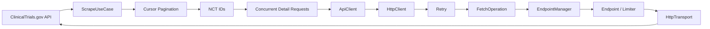
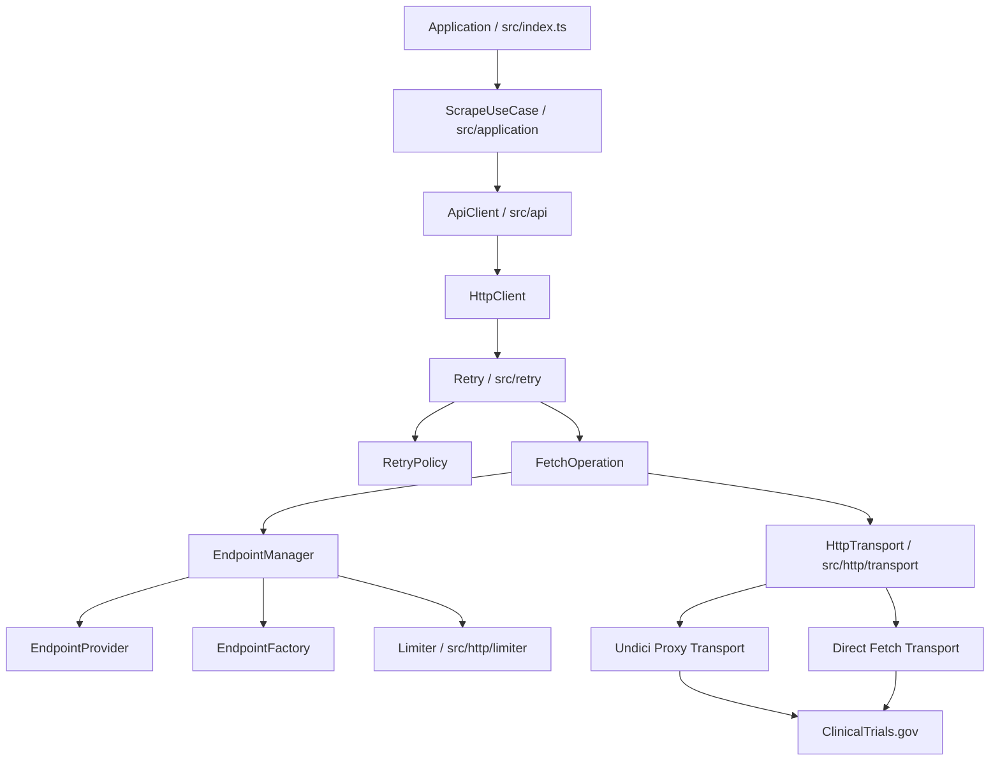
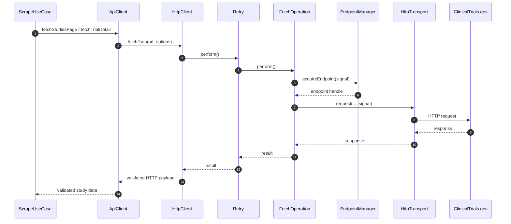
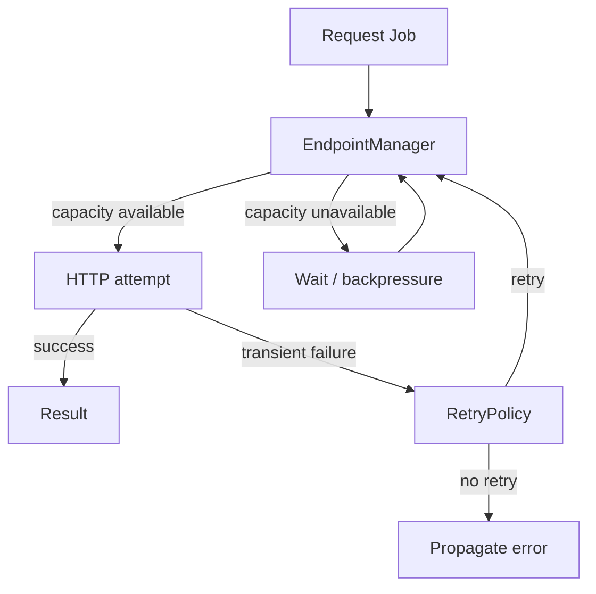
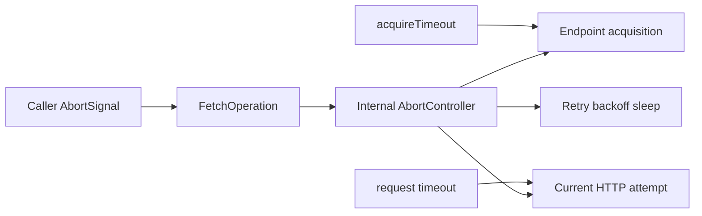
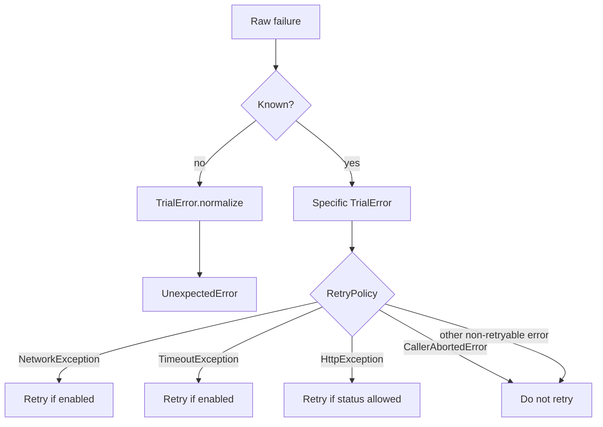
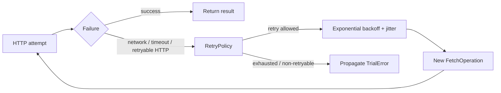
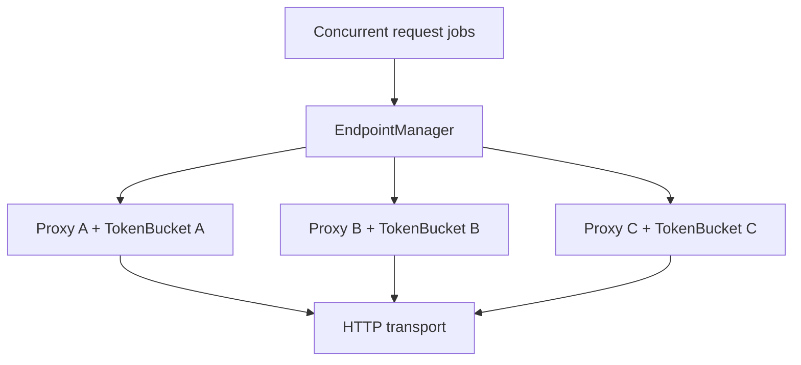
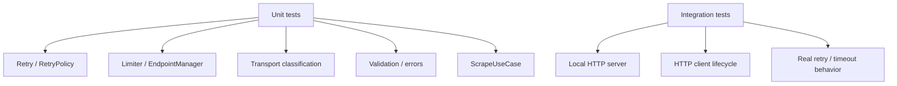

# ClinicalTrials.gov History Sync

A TypeScript data-acquisition service for retrieving clinical study records and historical study information from the **ClinicalTrials.gov API v2**.

The project is designed as a reliable, testable acquisition pipeline for large numbers of independent clinical-trial requests under pagination, concurrency, rate-limit, proxy, timeout, cancellation, and transient-failure constraints.

> **Current scope:** the application fetches and validates study data. It does not currently provide a database, durable output store, or durable checkpoint system.

## At a glance



The main architectural boundary is:

```text
Application asks:
    "What study data do I need?"

Infrastructure answers:
    "How should this request be executed reliably?"
```

## What the application does

A typical scrape is:

1. Load and validate environment configuration into a typed `AppConfig`.
2. Build application dependencies at the composition boundary.
3. Start `ScrapeUseCase` with explicit scrape configuration.
4. Build a ClinicalTrials.gov study query.
5. Fetch a page of studies.
6. Follow `nextPageToken` until pagination is complete.
7. Extract NCT identifiers.
8. Fetch study details concurrently.
9. Optionally request historical study information.
10. Validate upstream responses.
11. Return successful records and classify failures through the project's error model.

Current scrape progress/checkpoint state is in memory and is not durable across process restarts. Study output is also currently held in memory.

## Architecture

The repository separates application orchestration, the ClinicalTrials.gov API adapter, HTTP orchestration, retry behavior, endpoint admission, rate limiting, and concrete network transport.



### Component responsibilities

| Component | Responsibility |
| --- | --- |
| `src/index.ts` | Bootstrap, configuration loading, dependency composition, process-level signal/shutdown handling |
| `ScrapeUseCase` | Pagination, concurrent detail fetching, per-item failure handling, in-memory progress, scrape-level logging |
| `ApiClient` | Domain-facing ClinicalTrials.gov operations and API-specific validation |
| `HttpClient` | HTTP request orchestration, retry setup, response handling, and resource lifecycle |
| `FetchOperation` | One HTTP attempt: endpoint acquisition, timeout/cancellation propagation, transport invocation, and response lifecycle |
| `Retry` | Retry attempts, retry decisions, backoff, jitter, and cancellation during backoff |
| `RetryPolicy` | Retry eligibility, retryable HTTP statuses, Retry-After parsing, backoff calculation, and configuration validation |
| `EndpointManager` | Endpoint selection, admission waiting, and endpoint-acquisition timeout |
| `EndpointProvider` | Defines how concrete endpoints are described for direct or proxy acquisition |
| `EndpointFactory` | Builds runtime endpoints, including limiter/transport construction and cleanup/rollback |
| `Endpoint` / `EndpointHandle` | Runtime endpoint resource and its narrow acquired-operation view |
| `Limiter` | Per-endpoint request admission/rate control |
| `HttpTransport` | Abstract network execution and transport-level error classification |
| `TrialError` hierarchy | Stable domain/infrastructure error contract |
| `src/utils` | Small shared utilities such as assertion helpers |

## Request lifecycle

The core execution path is explicit:



## Retry and endpoint admission

Retry and endpoint admission are deliberately separate concerns.



A temporarily unavailable rate-limit token is not the same as an unhealthy endpoint or a failed HTTP operation:

```text
token unavailable
    ≠ endpoint unhealthy
    ≠ transport failure
    ≠ HTTP retry failure
```

A retry may acquire another endpoint. This keeps endpoint selection separate from failure recovery and allows later attempts to use another proxy when multiple endpoints are configured.

## Timeout and cancellation model

There is no global request deadline or shared timeout budget. The implementation uses independent controls for caller cancellation, endpoint acquisition, the current HTTP attempt, and retry backoff.



| Control | Owner | Scope |
| --- | --- | --- |
| Caller `AbortSignal` | Caller | Whole logical operation |
| Internal `AbortController` | `FetchOperation` | Current attempt and propagation |
| `ACQUIRE_TIMEOUT` | `EndpointManager` | Waiting for endpoint capacity |
| `FETCH_TIMEOUT_MS` | `FetchOperation` | One HTTP attempt |
| Retry backoff | `Retry` | Time between attempts |

The sequence is therefore:

```text
acquire endpoint
      ↓
endpoint acquired
      ↓
start fetch timeout
      ↓
HTTP attempt
      ↓
timeout / failure
      ↓
RetryPolicy
      ↓
new attempt with a new timeout
```

A retry does not consume a shrinking shared timeout budget.

## Error model

Failures crossing project boundaries use the centralized `TrialError` taxonomy.



The core rule is:

> **Known error → specific `TrialError`. Unknown error → `UnexpectedError`.**

Important categories include:

- `ConfigurationError` — invalid application/system configuration.
- `TrialValidationError` — invalid public operation input.
- `ApiResponseValidationError` — invalid upstream response.
- `TrialNotFoundError` — requested trial does not exist.
- `HttpException` — unsuccessful HTTP status.
- `NetworkException` — network-level transport failure.
- `TimeoutException` — defined operation timeout.
- `CallerAbortedError` — explicit caller cancellation; never retry.
- `EndpointAssemblyError` — endpoint construction/rollback failure.
- `RetryDelayCalculationError` — failure while calculating retry delay.
- `UnexpectedError` — unknown failure after normalization.

Retry decisions operate on these semantic errors rather than arbitrary JavaScript exceptions.

## Retry model

The retry engine is generic and independent from the concrete operation.



The retry subsystem supports:

- configurable retry count;
- retryable HTTP status codes;
- independent network-error and timeout retry switches;
- exponential backoff;
- jitter;
- bounded backoff cap;
- `Retry-After` delay-seconds parsing;
- `Retry-After` HTTP-date parsing;
- cancellation during backoff;
- explicit per-request retry-policy overrides;
- validation of retry policy configuration.

`Retry-After` takes precedence over calculated exponential backoff and is capped by the configured backoff limit.

`RetryPolicy` also protects the retry contract by rejecting invalid configuration such as non-boolean retry switches, invalid status codes, a retryable `404`, and a backoff cap smaller than the base delay.

## Rate limiting and concurrency

These mechanisms solve different problems:

```text
Concurrency
    = how many operations may be active

Rate limiting
    = how quickly requests may be admitted

Retry
    = how a failed HTTP operation recovers
```

The current design uses per-endpoint token buckets:



The token bucket uses a monotonic clock, lazy refill, burst capacity, and deterministic timing seams for testing.

> Multiple proxies do **not** automatically mean unlimited upstream capacity. Actual throughput must be established from measurements and upstream behavior such as `429` responses.

## Configuration

Configuration is loaded at the application boundary:

```text
Environment variables
        ↓
    loadConfig()
        ↓
      AppConfig
        ↓
 composition root
        ↓
 narrow config objects
        ↓
 infrastructure components
```

Lower-level components do not depend on environment-derived globals. Configuration is passed explicitly through typed objects and validated before the runtime graph is assembled.

Start with `.env.example`.

| Area | Environment variables | Purpose |
| --- | --- | --- |
| API | `API_BASE_URL`, `API_DETAIL_URL`, `PAGE_SIZE` | Upstream endpoints and page size |
| Performance | `CONCURRENCY` | Concurrent detail requests |
| Timeout | `FETCH_TIMEOUT_MS`, `ACQUIRE_TIMEOUT` | HTTP-attempt and endpoint-admission limits |
| Proxy | `PROXY_URLS`, `PROXY_POOL_CONNECTIONS`, `MAX_POOL_CONNECTIONS`, `PROXY_POOL_*` | Proxy endpoints and connection-pool settings |
| Rate limit | `RATE_LIMIT_CAPACITY`, `RATE_LIMIT_WINDOW` | Token-bucket admission |
| Retry | `MAX_RETRIES`, `RETRYABLE_STATUS_CODES`, `RETRY_ON_TIMEOUT`, `RETRY_ON_NETWORK_ERROR` | Retry policy |
| Backoff | `RETRY_BASE_DELAY_MS`, `BACKOFF_CAP_MS` | Retry delay calculation |
| Logging | `LOG_LEVEL`, `LOG_TO_FILE`, `NODE_ENV` | Structured logging |
| Client identity | `DEFAULT_USER_AGENT` | HTTP `User-Agent` |

## Observability

Structured logging is implemented with **Pino**.

Useful context includes:

- correlation/request ID;
- operation name;
- NCT ID;
- page number;
- endpoint identity where appropriate;
- HTTP status;
- attempt/retry information;
- request duration;
- success/failure counts.

Correlation IDs are useful when one logical operation produces multiple physical HTTP attempts. Sensitive URL components are sanitized before logging.

## Testing

Testing follows the same boundaries as the architecture.



The test suite covers configuration, error taxonomy, API behavior, application orchestration, endpoint management, limiters, transport implementations, retry semantics, cancellation, request/response validation, logging, and integration behavior.

Tests emphasize **contracts and observable behavior**: pagination, concurrency, attempt counts, retry decisions, cancellation, backoff, endpoint acquisition, response validation, and resource lifecycle.

## Repository structure

```text
.
├── docs/
│   ├── ARCHITECTURE_REVIEW.md
│   ├── ARCHITECTURE_UML.md
│   ├── TECH_DEBT.md
│   └── mermaid-diagram-*.png
│
├── src/
│   ├── api/                 # ClinicalTrials.gov API adapter
│   ├── application/        # Application use cases and scrape orchestration
│   ├── config/              # Typed configuration, validation and logging
│   ├── error/               # Domain/infrastructure error taxonomy
│   ├── http/
│   │   ├── endpoint/        # Endpoint/provider/factory/manager
│   │   ├── limiter/         # Rate limiting
│   │   └── transport/       # HTTP transport implementations
│   ├── retry/               # Retry engine, fetch operation and retry policy
│   ├── utils/               # Shared assertion/utilities
│   └── index.ts             # Bootstrap / composition entry point
│
├── test/                    # Unit and integration tests
├── examples/
├── .env.example
├── jest.config.mjs
├── eslint.config.js
├── tsconfig.json
└── package.json
```

## Data source

The project targets the **ClinicalTrials.gov API v2**, primarily using:

```text
GET /api/v2/studies
GET /api/v2/studies/{nctId}
```

The studies endpoint supports search and cursor-based pagination. The detail endpoint retrieves an individual study and can request historical information.

## Getting started

### Requirements

- Node.js 20+
- npm

### Install

```bash
npm install
```

### Configure

```bash
cp .env.example .env
```

Review the environment values before running the application. All configuration is loaded and validated at startup.

### Run

```bash
npm start
```

The application bootstrap entry point is `src/index.ts`.

## Development commands

```bash
npm start
npm test
npm run test:watch
npm run typecheck
npm run lint
npm run lint:fix
npm run format
npm run format:check
```

## Documentation

- [`docs/ARCHITECTURE_REVIEW.md`](docs/ARCHITECTURE_REVIEW.md) — detailed architectural assessment and evolution plan.
- [`docs/ARCHITECTURE_UML.md`](docs/ARCHITECTURE_UML.md) — deeper UML/current-system model.
- [`docs/TECH_DEBT.md`](docs/TECH_DEBT.md) — tracked technical debt and scalability considerations.

## Technology stack

- **TypeScript 5.x** — application language
- **Node.js / ESM** — runtime and module system
- **Undici** — pooled HTTP/proxy transport
- **Pino** — structured logging
- **Jest 30** — testing
- **ESLint 9** — static analysis
- **Prettier 3** — formatting

## Current status

The project is an actively developed ClinicalTrials.gov acquisition and synchronization codebase.

The current implementation is deliberately focused on a robust HTTP acquisition foundation: configuration validation, API integration, endpoint admission, rate limiting, connection management, retry semantics, timeout/cancellation contracts, error classification, observability, and deterministic testing.

The next architectural steps are primarily above these HTTP primitives: bounded streaming/backpressure, durable output and checkpoints, idempotent synchronization/recovery, quantitative throughput/queue metrics, and incremental historical synchronization.