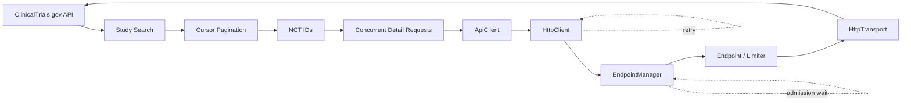
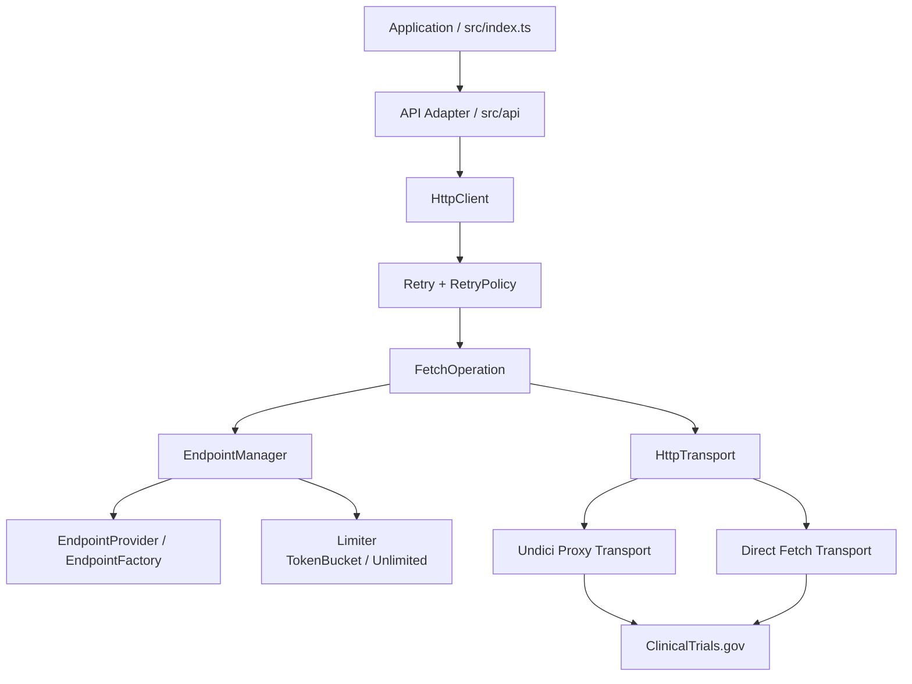
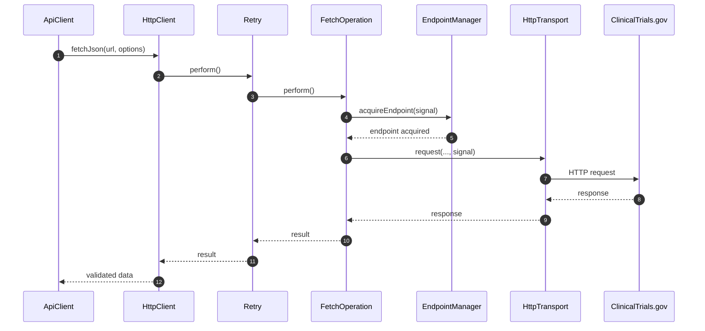
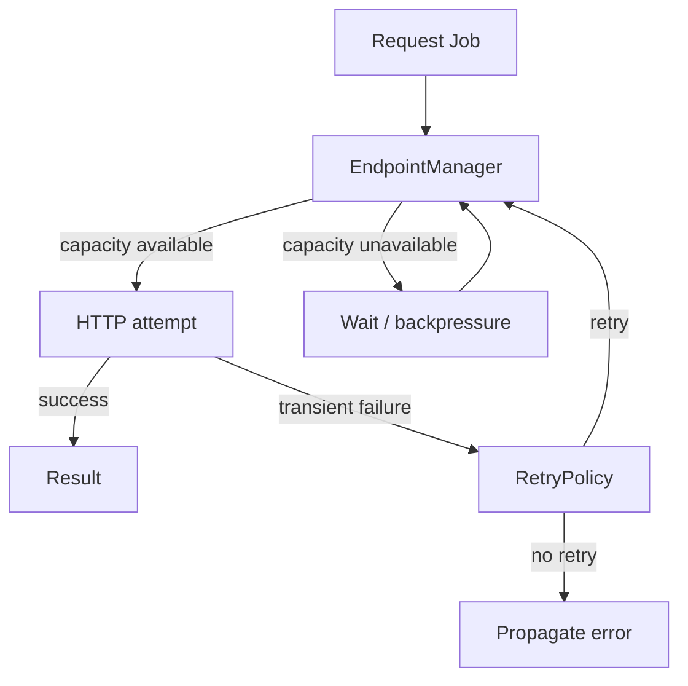
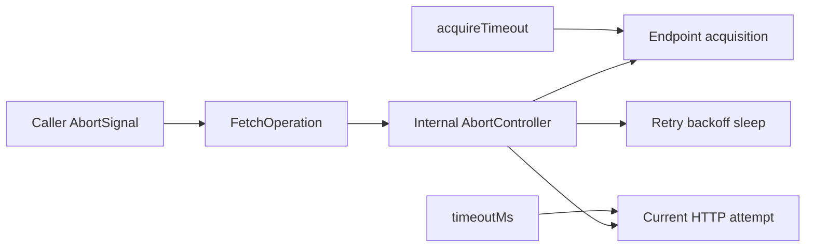
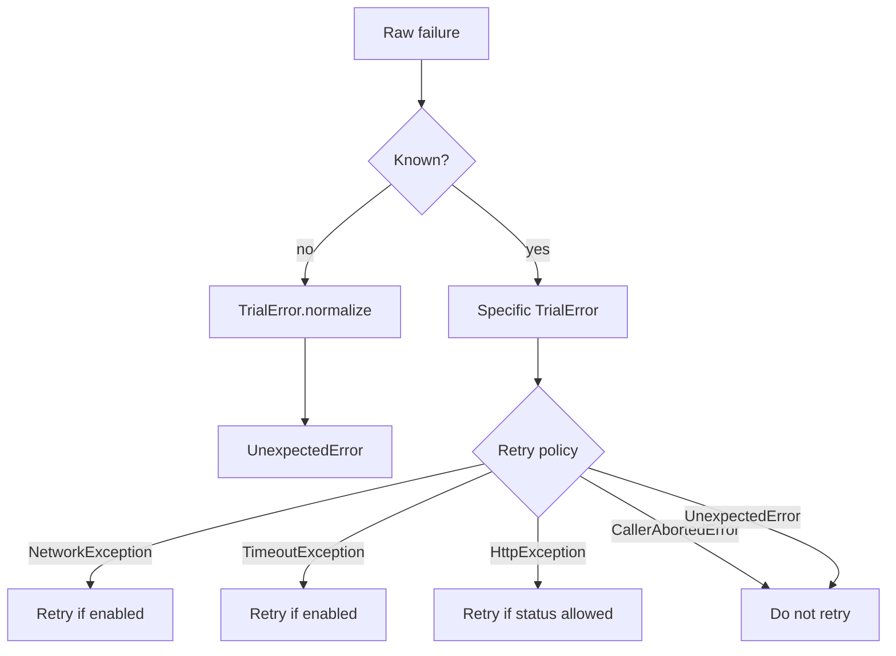
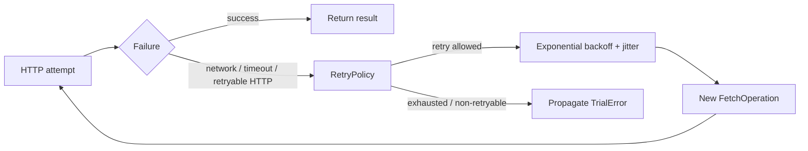
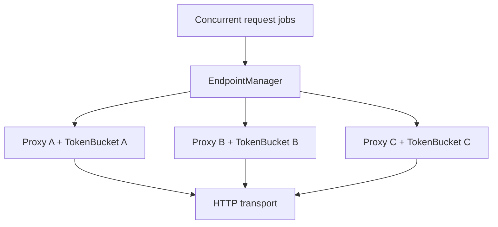
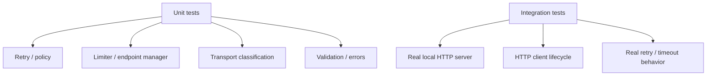

# ClinicalTrials.gov History Sync

A TypeScript data-acquisition service for retrieving clinical study records and historical study information from the **ClinicalTrials.gov API v2**.

The project is more than an API scraper. Its main engineering goal is to provide a **reliable, testable, observable acquisition pipeline** for large numbers of independent clinical-trial requests under pagination, concurrency, rate-limit, proxy, timeout, cancellation, and transient-failure constraints.

> **Current scope:** the application fetches and validates study data. It does not currently provide a database, durable output store, or durable checkpoint system.

## At a glance



The important distinction is:

```text
Application asks:
    "What study data do I need?"

Infrastructure answers:
    "How should this request be executed reliably?"
```

## What the application does

A typical run is:

1. Build a ClinicalTrials.gov study query.
2. Fetch a page of studies.
3. Follow `nextPageToken` until pagination is complete.
4. Extract NCT identifiers.
5. Fetch study details concurrently.
6. Optionally request historical study information.
7. Validate responses.
8. Return successful records and classify failures through the project's error model.

The current entry point also maintains in-memory page/checkpoint state and emits structured execution information through logging.

## System architecture

The repository deliberately separates the API adapter from HTTP execution, endpoint admission, transport, and retry mechanics.



### Responsibilities

| Component              | Responsibility                                                           |
| ---------------------- | ------------------------------------------------------------------------ |
| `src/index.ts`         | Application orchestration, pagination, concurrency and checkpoint state  |
| `ApiClient`            | Domain-facing ClinicalTrials.gov operations                              |
| `HttpClient`           | HTTP request orchestration and response handling                         |
| `FetchOperation`       | One logical HTTP attempt: acquire endpoint, timeout, transport call      |
| `Retry`                | Retry attempts, retry decisions, backoff and cancellation during backoff |
| `EndpointManager`      | Endpoint selection, admission waiting and acquisition timeout            |
| `EndpointProvider`     | Creates endpoint definitions and their transports/limiters               |
| `Limiter`              | Per-endpoint request admission/rate control                              |
| `HttpTransport`        | Abstract network execution and transport-level classification            |
| `TrialError` hierarchy | Stable application/infrastructure error contract                         |

## Request lifecycle

The core execution path is intentionally explicit:



## Retry and endpoint admission are different concerns

This distinction is one of the important architectural decisions in the project.



A temporarily unavailable token is **not the same thing** as a failed endpoint and is not inherently an HTTP failure.

Conceptually:

```text
token unavailable
    ≠ endpoint unhealthy
    ≠ transport failure
    ≠ HTTP retry failure
```

A future endpoint-health/cooldown mechanism may be introduced if production measurements justify it, but it is intentionally separate from token-bucket rate limiting.

## Timeout and cancellation model

The project intentionally has **no global request deadline or shared timeout budget**.

There are three independent controls:



| Control           | Owner             | Scope                           |
| ----------------- | ----------------- | ------------------------------- |
| `signal`          | Caller            | Whole logical operation         |
| `AbortController` | `FetchOperation`  | Current attempt and propagation |
| `acquireTimeout`  | `EndpointManager` | Waiting for endpoint capacity   |
| `timeoutMs`       | `FetchOperation`  | One HTTP attempt                |
| Retry backoff     | `Retry`           | Time between attempts           |

Therefore:

```text
acquire endpoint
      ↓
endpoint acquired
      ↓
start timeoutMs
      ↓
HTTP attempt
      ↓
timeout / failure
      ↓
Retry policy
      ↓
new attempt with a new timeout
```

There is no shrinking `remainingBudget` passed from attempt to attempt.

## Error model

Failures crossing project boundaries use the centralized `TrialError` taxonomy.



The core rule is:

> **Known error → specific `TrialError`. Unknown error → `UnexpectedError`.**

Important categories include:

- `ConfigurationError` — invalid application/system configuration.
- `TrialValidationError` — invalid public operation input.
- `ApiResponseValidationError` — invalid upstream response.
- `TrialNotFoundError` — requested trial does not exist.
- `HttpException` — unsuccessful HTTP status.
- `NetworkException` — network-level transport failure.
- `TimeoutException` — defined operation timeout.
- `CallerAbortedError` — explicit caller cancellation; never retry.
- `EndpointAssemblyError` — endpoint construction/rollback failure.
- `UnexpectedError` — unknown failure after normalization.

HTTP retry decisions are based on these semantic errors rather than arbitrary JavaScript exceptions.

## Retry model

The retry engine is generic and independent from the concrete operation.



The retry subsystem supports:

- configurable retry count;
- retryable HTTP status codes;
- network-error retry policy;
- timeout retry policy;
- exponential backoff;
- jitter;
- bounded backoff cap;
- `Retry-After` handling;
- cancellation during backoff.

A retry may acquire another endpoint. This keeps endpoint selection separate from failure recovery and allows a later attempt to use another proxy when the endpoint pool contains multiple candidates.

## Rate limiting and concurrency

These mechanisms solve different problems:

```text
Concurrency
    = how many operations may be active

Rate limiting
    = how quickly requests may be admitted

Retry
    = how a failed HTTP operation recovers
```

The current design uses per-endpoint token buckets:



The token bucket uses a monotonic clock, lazy refill, burst capacity, and deterministic timing seams for testing.

> Multiple proxies do **not** automatically mean unlimited upstream capacity. Actual throughput must be established from measurements and upstream behavior such as `429` responses.

## Observability

Structured logging is implemented with **Pino**.

Useful context includes:

- correlation/request ID;
- operation name;
- NCT ID;
- page number;
- endpoint identity where appropriate;
- HTTP status;
- attempt/retry information;
- request duration;
- success/failure counts.

Correlation IDs are especially useful when one logical request produces multiple physical HTTP attempts.

Sensitive URL components are sanitized before logging.

## Testing philosophy

Testing follows the same boundaries as the architecture.



The test suite covers configuration, error taxonomy, API behavior, endpoint management, limiters, transport implementations, retry semantics, cancellation, request/response validation, logging, and integration behavior.

Integration tests use local HTTP servers where appropriate so that important behavior is verified against real TCP/HTTP execution rather than only mocks.

Tests emphasize **contracts and observable behavior**: attempt counts, retry decisions, cancellation, backoff, endpoint acquisition, response validation, and resource lifecycle.

## Current architecture and future direction

The HTTP subsystem is intentionally strong and modular. The main remaining architectural gaps are above and around it rather than inside the basic HTTP primitives.

### Current gaps

- `src/index.ts` still combines application orchestration, pagination, concurrency, and in-memory checkpoint state.
- The composition root directly wires the production proxy/transport stack.
- Configuration is still consumed from module-level exports in several layers.
- Checkpoint and failed-work recovery are not durable.
- Observability can be extended with quantitative throughput, queue-depth, endpoint-wait, retry, and failure metrics.

### Deliberate non-goals for the current scope

The project does **not** currently need speculative abstractions for browser automation, raw sockets, generic plugins, or a universal fallback engine.

A higher-level acquisition strategy boundary may become useful if the project genuinely needs fundamentally different acquisition mechanisms. The current HTTP abstraction is sufficient for the existing scope.

## Repository structure

```text
.
├── docs/
│   ├── ARCHITECTURE_REVIEW.md
│   ├── ARCHITECTURE_UML.md
│   ├── TECH_DEBT.md
│   └── mermaid-diagram-*.png
│
├── src/
│   ├── api/                 # ClinicalTrials.gov API adapter
│   ├── config/              # Configuration and logging setup
│   ├── error/               # Domain error taxonomy
│   ├── http/
│   │   ├── endpoint/        # Endpoint/provider/manager
│   │   ├── limiter/         # Rate limiting
│   │   └── transport/       # HTTP transport implementations
│   ├── retry/               # Retry engine and retry policy
│   └── index.ts             # Application entry point
│
├── test/                    # Unit and integration tests
├── examples/
├── .env.example
├── jest.config.mjs
├── eslint.config.js
├── tsconfig.json
└── package.json
```

## Data source

The project targets the **ClinicalTrials.gov API v2**, primarily using:

```text
GET /api/v2/studies
GET /api/v2/studies/{nctId}
```

The studies endpoint provides search and cursor-based pagination. The detail endpoint retrieves an individual study and can request historical information.

## Configuration

Configuration is supplied through environment variables. Start with `.env.example`.

| Area        | Examples                                   | Purpose                               |
| ----------- | ------------------------------------------ | ------------------------------------- |
| API         | `API_BASE_URL`, `API_DETAIL_URL`           | Upstream endpoints                    |
| Performance | `PAGE_SIZE`, `CONCURRENCY`                 | Pagination and parallel work          |
| Timeout     | `FETCH_TIMEOUT_MS`, `ACQUIRE_TIMEOUT`      | Attempt and endpoint-admission limits |
| Proxy       | `PROXY_URLS`, `PROXY_POOL_*`               | Proxy endpoints and connection pools  |
| Rate limit  | `RATE_LIMIT_CAPACITY`, `RATE_LIMIT_WINDOW` | Token-bucket admission                |
| Retry       | `MAX_RETRIES`, `RETRYABLE_STATUS_CODES`    | Retry policy                          |
| Backoff     | `RETRY_BASE_DELAY_MS`, `BACKOFF_CAP_MS`    | Retry delay calculation               |
| Logging     | `LOG_LEVEL`, `LOG_TO_FILE`                 | Structured logging                    |

## Getting started

### Requirements

- Node.js 20+
- npm

### Install

```bash
npm install
```

### Configure

```bash
cp .env.example .env
```

Configure API, concurrency, proxy, rate-limit, retry, timeout, and logging values as appropriate for the environment.

### Run

```bash
npm start
```

The current application entry point is `src/index.ts`.

## Development commands

```bash
npm start
npm test
npm run test:watch
npm run typecheck
npm run lint
npm run lint:fix
npm run format
npm run format:check
```

## Documentation

- [`docs/ARCHITECTURE_REVIEW.md`](docs/ARCHITECTURE_REVIEW.md) — detailed architectural assessment and evolution plan.
- [`docs/ARCHITECTURE_UML.md`](docs/ARCHITECTURE_UML.md) — deeper UML/current-system model.
- [`docs/TECH_DEBT.md`](docs/TECH_DEBT.md) — tracked technical debt.

## Technology stack

- **TypeScript** — application language
- **Node.js / ESM** — runtime and module system
- **Undici** — pooled HTTP/proxy transport
- **Pino** — structured logging
- **Jest** — testing
- **ESLint** — static analysis
- **Prettier** — formatting

## Project status

The project is an actively developed ClinicalTrials.gov acquisition and synchronization codebase.

Its central engineering concern is **reliable outbound acquisition**: endpoint admission, rate limiting, connection management, retry semantics, timeout/cancellation contracts, error classification, observability, and testability.
