# Project UML — bottom to top

This is a high-level UML-style dependency view of the scraper. It is arranged
from the lowest-level infrastructure at the bottom to the application entry
point at the top. Arrows point from the consumer to the dependency it uses.

```mermaid
flowchart BT
    subgraph L0["Foundation: external runtime and shared cross-cutting code"]
        undici["undici\nfetch · ProxyAgent · Pool"]
        nodeFetch["Node.js fetch / AbortController"]
        pino["pino logger"]
        config["config\nconfiguration + defaults"]
        validation["validation\nassertions + NCT ID validation"]
        errors["TrialError hierarchy\nConfiguration · HTTP · Network · Timeout · …"]
        clock["Clock / Sleeper / RandomSource"]
    end

    subgraph L1["HTTP primitives"]
        httpTransport["«interface» HttpTransport\nrequest() · classifyError() · close()"]
        directTransport["FetchDirectTransport"]
        proxyTransport["UndiciHttpTransport"]
        directFactory["«interface» DirectTransportFactory"]
        fetchFactory["FetchDirectTransportFactory"]
        proxyFactory["«interface» ProxyTransportFactory"]
        undiciFactory["UndiciTransportFactory"]
        limiter["«abstract» Limiter\ntryAcquire() · timeUntilToken()"]
        unlimited["UnlimitedLimiter"]
        tokenBucket["TokenBucket"]
        limiterFactory["«interface» LimiterFactory"]
        defaultLimiterFactory["DefaultLimiterFactory"]
    end

    subgraph L2["Endpoint construction and selection"]
        provider["«interface» EndpointProvider\nbuild()"]
        directProvider["DirectEndpointProvider"]
        proxyProvider["ProxyEndpointProvider"]
        urlParser["«interface» ProxyUrlParser"]
        httpUrlParser["HttpProxyUrlParser"]
        endpointDef["EndpointDefinition"]
        endpoint["Endpoint\nLimiter + HttpTransport"]
        endpointFactory["EndpointFactory"]
        endpointManager["EndpointManager\nround-robin acquisition"]
    end

    subgraph L3["Request execution and resilience"]
        operation["«interface» BusinessOperation&lt;T&gt;"]
        fetchOperation["FetchOperation\nendpoint acquisition + request"]
        retry["Retry&lt;T&gt;\nretry loop + abortable backoff"]
        retryPolicy["retryPolicy\nshouldRetry() + calculateBackoff()"]
        responseBody["responseBody\nparse / drain response"]
        requestValidation["requestValidation"]
        httpClient["«interface» HttpClient\nfetchJson() · close()"]
        createHttpClient["createHttpClient()"]
    end

    subgraph L4["ClinicalTrials.gov API adapter"]
        urlBuilder["UrlBuilder"]
        apiTypes["Study · StudiesPageResponse\nrequest parameter types"]
        responseValidation["parseStudiesPageResponse()"]
        apiClient["«interface» ApiClient\nfetchStudiesPage() · fetchTrialDetail()"]
        createApiClient["createApiClient()"]
    end

    subgraph L5["Application"]
        index["index.ts\nconfigure → fetch pages → fetch details"]
        ctApi["ClinicalTrials.gov API"]
    end

    directTransport -. "implements" .-> httpTransport
    proxyTransport -. "implements" .-> httpTransport
    fetchFactory -. "implements" .-> directFactory
    undiciFactory -. "implements" .-> proxyFactory
    directFactory --> directTransport
    proxyFactory --> proxyTransport
    proxyTransport --> undici
    directTransport --> nodeFetch
    undiciFactory --> undici
    unlimited -. "extends" .-> limiter
    tokenBucket -. "extends" .-> limiter
    defaultLimiterFactory -. "implements" .-> limiterFactory
    defaultLimiterFactory --> unlimited
    defaultLimiterFactory --> tokenBucket
    tokenBucket --> clock

    directProvider -. "implements" .-> provider
    proxyProvider -. "implements" .-> provider
    directProvider --> directFactory
    proxyProvider --> proxyFactory
    proxyProvider --> urlParser
    httpUrlParser -. "implements" .-> urlParser
    provider --> endpointDef
    endpointFactory --> provider
    endpointFactory --> limiterFactory
    endpointFactory --> endpoint
    endpoint --> limiter
    endpoint --> httpTransport
    endpointManager --> endpoint
    endpointManager --> clock

    fetchOperation -. "implements" .-> operation
    retry -. "implements" .-> operation
    fetchOperation --> endpointManager
    fetchOperation --> httpTransport
    fetchOperation --> responseBody
    fetchOperation --> clock
    retry --> operation
    retry --> retryPolicy
    retry --> clock
    createHttpClient -. "returns" .-> httpClient
    createHttpClient --> endpointFactory
    createHttpClient --> endpointManager
    createHttpClient --> fetchOperation
    createHttpClient --> retry
    createHttpClient --> requestValidation
    createHttpClient --> responseBody
    createHttpClient --> retryPolicy

    createApiClient -. "returns" .-> apiClient
    createApiClient --> httpClient
    createApiClient --> urlBuilder
    createApiClient --> responseValidation
    createApiClient --> apiTypes
    urlBuilder --> validation
    responseValidation --> apiTypes

    index --> createHttpClient
    index --> proxyProvider
    index --> undiciFactory
    index --> httpUrlParser
    index --> createApiClient
    index --> config
    index --> pino
    apiClient --> ctApi

    config --> validation
    requestValidation --> validation
    provider --> validation
    endpointManager --> validation
    retryPolicy --> errors
    fetchOperation --> errors
    responseBody --> errors
    createApiClient --> errors
```



## Reading the main request path

`index.ts` configures a proxy-based `HttpClient`, creates an `ApiClient`, and
starts the scrape. `ApiClient` turns study queries into URLs, while `HttpClient`
coordinates endpoint selection, rate limiting, request execution, retries, and
JSON response parsing. Each `Endpoint` combines one `Limiter` with one
`HttpTransport`; the selected transport finally performs the network request.

The active production path is:

```text
index.ts
  → ProxyEndpointProvider + UndiciTransportFactory
  → createHttpClient → EndpointFactory → EndpointManager
  → Retry → FetchOperation → Endpoint
  → UndiciHttpTransport → undici ProxyAgent → ClinicalTrials.gov
  → ApiClient validates/parses the response for the scraper
```

The project also supports a direct, non-proxy branch through
`DirectEndpointProvider → FetchDirectTransportFactory → FetchDirectTransport`.
